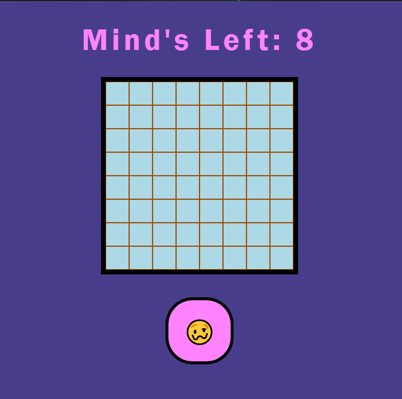
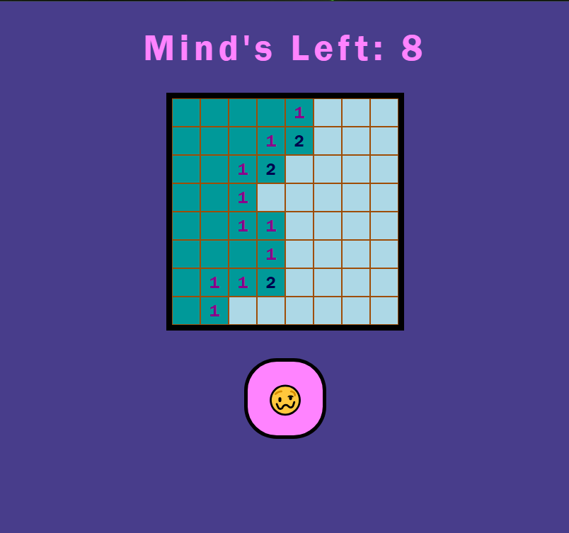
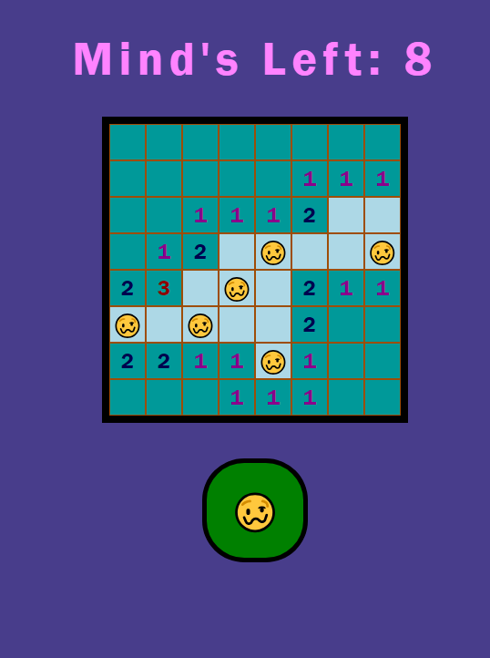
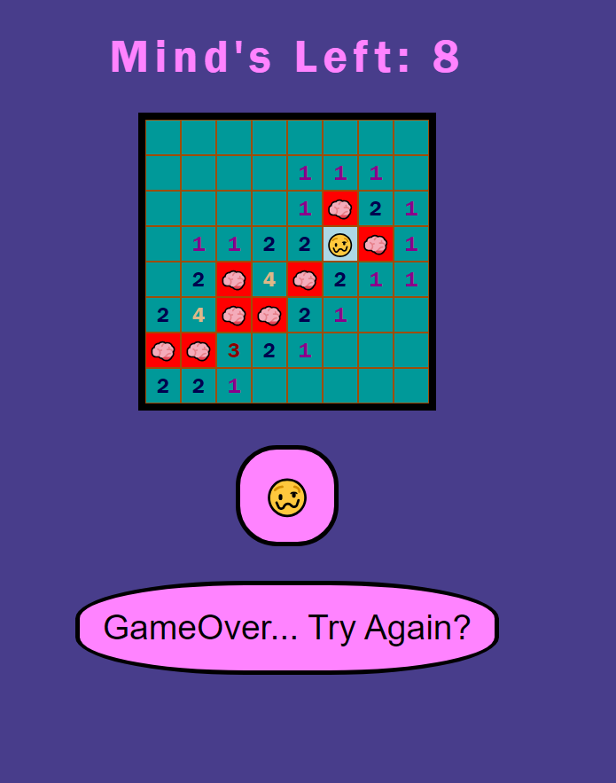
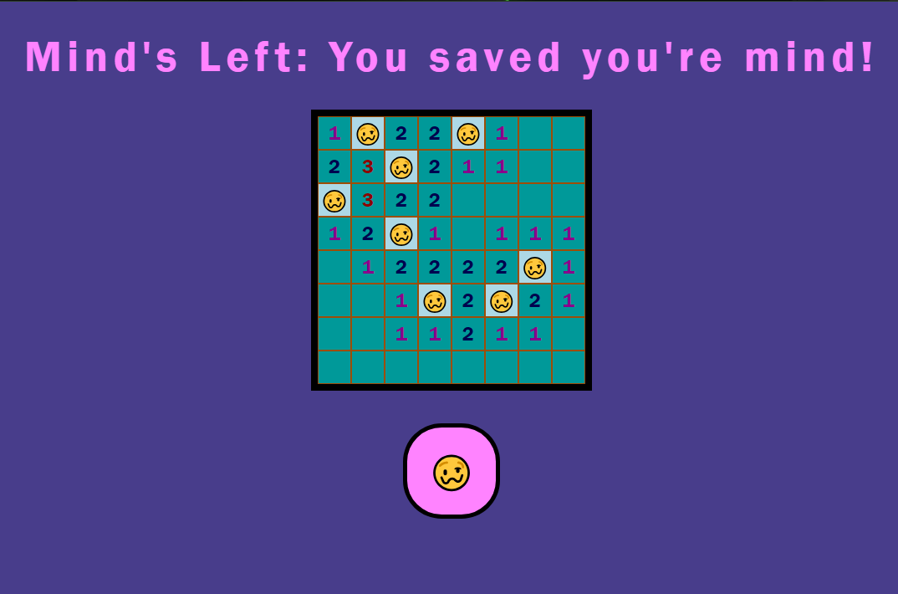

# MINDSWEEPER

ryancluis.github.io/Minesweeper/

## Overview
This game will be close to you typical minesweeper, where you mark the boxes if you think there is a mind and select boxes to see if there are minds near by or "flood" boxes around for your next hint. How the game works is the computer will generate 8 random squares to have "minds" behind them. You will click a random square to see whats behind that swuare. When revealed you will loose the game by hitting a mind, have nothing behind that square and reval everything around there until you see a number hint, or reval a number and click somewhere else. The goal in this game is you save all your "minds" and dont blow it!
___

## User Story
As a User, i want to...
- open the web browser to a game
- select a square to eleminate that choice and have three options: 1. keep playing 2. have the boxes remove and give me my next hint 3. hit a mind and startover
- see how many minds i will be dealing with
- have a option to "flag a square" so i dont click on it
- see a square i clicked on and see if there is an ant next to it
- have the ablity to play again
___

## Wireframe


___

## ScreenShots






___

## Code Used
This code is used to `Randomize` the minds so you dont get the same layout and duplicate minds to avoid!
```JS
let mindsLeft = minds;
    while (mindsLeft > 0) { 
        let r = Math.floor(Math.random() * rows)
        let c = Math.floor(Math.random() * columns)
        let id = r.toString() + "-" + c.toString()
        if (!mindsLocation.includes(id)) {
            mindsLocation.push(id)
            mindsLeft -= 1
        }
    }
}
```
___

## Technology Used
1. HTML5
2. CSS3
3. JavaScript
___

## Resources
- 🥴 this is the image for the toggle "flag" option
- 🧠 this is the emoji for the "bomb" 

## Future Updates
- Have the ability to input the amount of minds.
- Make visual effects of minds being squished!
- Have victory audio play when game won/losing audio for game over.

## Acknowledgment
#### My mom
- When i was trying to explain to her what ill be making for my first project, she never heard of the game minesweeper. After roughly 5 mins, she then asked me did i say minesweeper or mindsweeper. She thought it would be hilarious to make mindsweeper and not to "Blow your Mind" and thus how i came to the theme of Mindsweeper.